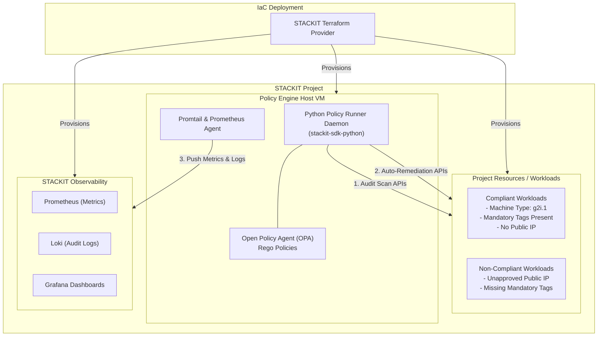

<!-- tags: opa-policy-reactive-agent, iaas, observability, iam, opa, rego, compliance, security -->

# STACKIT Reactive Policy Agent (AWS SCP-like Guardrails)

## Overview

This example demonstrates how to deploy an infrastructure-as-code (IaC) **Reactive Policy Agent** on **STACKIT** to enforce organizational governance controls equivalent to **AWS Service Control Policies (SCPs)**.

While AWS SCPs act as preventative organization-level guardrails, STACKIT environments can achieve the same security posture through a **declarative, reactive policy agent** powered by **Open Policy Agent (OPA)**, **Rego policies**, and **STACKIT APIs / Terraform Provider**. The agent continuously audits project resources, identifies non-compliant configurations, and automatically remediates policy violations in real-time.

> **Looking for pre-apply CI/CD pipeline validation?**
> Check out the complementary [**Preventive IaC OPA Plan Validation Example (`examples/opa-policy-terraform-plan-validation`)**](../opa-policy-terraform-plan-validation) to catch and block non-compliant IaC changes before `terraform apply`.

---

## AWS SCP vs. STACKIT Reactive Policy Engine

| AWS SCP Guardrail               | STACKIT Equivalent Policy    | Reactive Enforcement Action                                                     |
| :------------------------------ | :--------------------------- | :------------------------------------------------------------------------------ |
| **Deny Unapproved Public IPs**  | `SCP-01-NO-PUBLIC-IPS`       | Detaches / deletes public IPs lacking `allow-public-ip=true` label              |
| **Restrict EC2 Instance Types** | `SCP-02-ALLOWED-FLAVORS`     | Stops VMs running unauthorized machine types (e.g. unapproved GPUs)             |
| **Enforce Resource Tagging**    | `SCP-03-MANDATORY-TAGS`      | Detects missing `environment`, `owner`, `cost-center` tags & alerts/quarantines |
| **Enforce EBS Encryption**      | `SCP-04-VOLUME-ENCRYPTION`   | Detaches unencrypted volumes or volumes missing KMS key reference               |
| **Restrict IAM Admin Roles**    | `SCP-05-IAM-ADMIN-GUARDRAIL` | Revokes unauthorized `project.admin` or `iam.admin` role bindings               |

---

## Architecture



1. **Terraform** provisions the infrastructure, including the dedicated Policy Engine Service Account, Network, Router, VM host, Rego policies, and test workloads.
2. The **Policy Engine Daemon** runs periodically via `systemd` timer (every 60 seconds) on the Policy Host.
3. The engine fetches resource states across Compute, Storage, Networking, and IAM via STACKIT APIs.
4. Resource configurations are evaluated against **OPA Rego policies**.
5. Violations are logged to structured JSON audit logs and, in `remediate` mode, automatically remediated via STACKIT API calls.

---

## Policy Definitions

The engine includes 5 declarative Rego policies in `policies/`:

### 1. `scp_no_public_ips.rego`

Prohibits allocation or attachment of Public IPs unless explicitly tagged with `allow-public-ip = "true"`.

### 2. `scp_allowed_flavors.rego`

Restricts VM machine types to an approved list (configured via `var.allowed_machine_types`, e.g., `["g2i.1", "g2i.2", "c2i.2", "c2i.4"]`).

### 3. `scp_mandatory_tags.rego`

Enforces required labels/tags on all resources (`environment`, `owner`, `cost-center`).

### 4. `scp_volume_encryption.rego`

Requires that all storage volumes use KMS key encryption.

### 5. `scp_iam_guardrails.rego`

Prevents unauthorized subjects from holding administrative roles (`project.admin`, `iam.admin`).

---

## Quick Start

### Prerequisites

- [Terraform](https://developer.hashicorp.com/terraform/downloads) >= 1.5.0
- STACKIT Service Account with `project.admin` or `iaas.admin` permissions
- [STACKIT Service Account Key JSON file](https://docs.stackit.cloud/products/account-management/iam/) saved to `~/.stackit/sa-key.json`

### Usage

1. **Clone & Configure:**

```bash
cd examples/opa-policy-reactive-agent
cp terraform.tfvars.example terraform.tfvars
```

2. **Edit `terraform.tfvars`:**

Set your `stackit_project_id` and service account key path. You can choose between `enforcement_mode = "audit"` (detect only) or `enforcement_mode = "remediate"` (detect & auto-remediate).

```hcl
stackit_project_id               = "YOUR_STACKIT_PROJECT_ID"
stackit_service_account_key_path = "~/.stackit/sa-key.json"
ssh_public_key_path              = "~/.ssh/id_rsa.pub"
enforcement_mode                 = "remediate"
allowed_machine_types            = ["g2i.1", "g2i.2", "c2i.2", "c2i.4"]
mandatory_tags                   = ["environment", "owner", "cost-center"]
enable_demo_workloads            = true
```

3. **Deploy with Terraform:**

```bash
terraform init
terraform apply
```

4. **Verify Policy Engine Execution:**

Inspect the active policy engine output and retrieve the SSH command to view live audit logs:

```bash
terraform output audit_logs_command
```

Connect to the policy engine VM and view live execution logs:

```bash
ssh -i ~/.ssh/id_rsa ubuntu@<POLICY_ENGINE_PUBLIC_IP> 'sudo journalctl -u stackit-policy-engine.service -n 50 --no-pager'
```

Example JSON audit output:

```json
{"timestamp": "2026-08-21T13:19:17.435746+00:00", "event_type": "POLICY_SCAN_START", "details": {"mode": "remediate", "project_id": "YOUR_PROJECT_ID", "policies_count": 5}}
{"timestamp": "2026-08-21T13:19:17.591149+00:00", "event_type": "AUTH_SUCCESS", "details": {"sa_key_path": "/etc/stackit-policy-engine/sa-key.json"}}
{"timestamp": "2026-08-21T13:19:17.609233+00:00", "event_type": "RESOURCE_FETCH_SUCCESS", "details": {"resource_type": "public_ip", "count": 2}}
{"timestamp": "2026-08-21T13:19:17.675502+00:00", "event_type": "RESOURCE_DISCOVERY_SUMMARY", "details": {"servers_count": 2, "public_ips_count": 2, "volumes_count": 2, "role_bindings_count": 1}}
{"timestamp": "2026-08-21T13:19:17.721426+00:00", "event_type": "POLICY_EVAL_START", "details": {"policy_file": "scp_no_public_ips.rego", "evaluator": "OPA"}}
{"timestamp": "2026-08-21T13:19:17.733543+00:00", "event_type": "SCP_POLICY_VIOLATION", "details": {"id": "ip-987654321", "ip": "192.0.2.45", "policy": "SCP-01-NO-PUBLIC-IPS", "remediation_action": "delete_public_ip"}}
{"timestamp": "2026-08-21T13:19:17.733702+00:00", "event_type": "REMEDIATION_ACTION_EXEC", "details": {"action": "delete_public_ip", "public_ip_id": "ip-987654321", "status": "SUCCESS"}}
{"timestamp": "2026-08-21T13:19:17.761044+00:00", "event_type": "POLICY_SCAN_COMPLETE", "details": {"total_violations": 1, "enforcement_mode": "remediate"}}
```

---

## Configuration Variables

| Variable                           | Type           | Default                                   | Description                                                       |
| :--------------------------------- | :------------- | :---------------------------------------- | :---------------------------------------------------------------- |
| `stackit_project_id`               | `string`       | _Required_                                | STACKIT Project ID where policy engine is deployed                |
| `stackit_service_account_key_path` | `string`       | `~/.stackit/sa-key.json`                  | Path to STACKIT service account credentials                       |
| `ssh_public_key_path`              | `string`       | `~/.ssh/id_rsa.pub`                       | Path to SSH public key installed on policy host VM                |
| `stackit_region`                   | `string`       | `eu01`                                    | STACKIT Region                                                    |
| `availability_zone`                | `string`       | `eu01-1`                                  | STACKIT Availability Zone                                         |
| `boot_image_id`                    | `string`       | `012d2f5b-ee00-4700-9bea-cdabf0e1bfa8`    | Boot image UUID for Policy Engine and workload VMs                |
| `enforcement_mode`                 | `string`       | `remediate`                               | Policy mode: `audit` (logs only) or `remediate` (auto-remediates) |
| `allowed_machine_types`            | `list(string)` | `["g2i.1", "g2i.2", "c2i.2", "c2i.4"]`    | Approved VM machine types allowed under SCP-02                    |
| `mandatory_tags`                   | `list(string)` | `["environment", "owner", "cost-center"]` | Required resource labels under SCP-03                             |
| `policy_engine_machine_type`       | `string`       | `g2i.1`                                   | Machine type for the Policy Engine host VM                        |
| `policy_engine_disk_size`          | `number`       | `20`                                      | Boot disk size (GB) for the Policy Engine host VM                 |
| `enable_demo_workloads`            | `bool`         | `true`                                    | Provision demo compliant & non-compliant workloads for validation |

---

## Extending Policies

To add custom SCP policies:

1. Create a new `.rego` file in `policies/` (e.g. `policies/scp_s3_public_access.rego`).
2. Define `violations[violation]` rules matching your governance requirements.
3. Update `060-policies-config.tf` and re-run `terraform apply`.

---

## Cleanup

To destroy all deployed resources:

```bash
terraform destroy
```

---

## References

- [STACKIT Documentation](https://docs.stackit.cloud/)
- [STACKIT API Documentation](https://docs.api.stackit.cloud/)
- [STACKIT Terraform Provider](https://registry.terraform.io/providers/stackitcloud/stackit/latest/docs)
- [Open Policy Agent (OPA) Documentation](https://www.openpolicyagent.org/docs/latest/)
