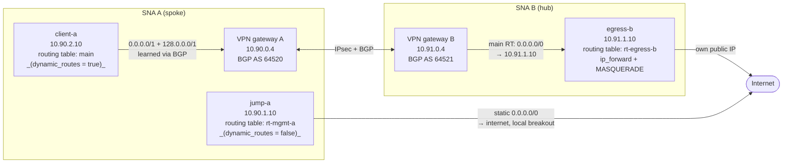

<!-- tags: vpn, networking, ipsec, site-to-site, bgp, routing, egress, hub-and-spoke, iaas, ha, full-tunnel, central-egress -->

# STACKIT Managed VPN: Full-Tunnel Routing with Central Egress

## Overview

This example deploys a workload in one [STACKIT Network Area](https://docs.stackit.cloud/products/network/core-networking/network-area/)
(SNA) that sends **all** of its traffic — including internet traffic — through
the [STACKIT Managed VPN](https://docs.stackit.cloud/products/network/connectivity-hybrid-multi-cloud/vpn/)
into a second SNA, where one central machine is the only way out to the
internet. A jump host in the same spoke SNA deliberately keeps its own local
breakout.

Two STACKIT projects are created, each with its own network area, three
machines and one VPN gateway per side, connected over a BGP route-based IPsec
tunnel pair.

Tested with provider `stackitcloud/stackit` 0.114.0 in region `eu01`.



Both boxes on the left are the _same_ network area. The only difference between
them is which routing table their network is attached to. One machine sends its traffic through the tunnel and the other machine goes out directly to the internet.
The effect on `client-a`, without and with the full-tunnel configuration:

|                               | without full tunnel                | with full tunnel                                                                                         |
| ----------------------------- | ---------------------------------- | -------------------------------------------------------------------------------------------------------- |
| `curl -4 https://ifconfig.io` | the SNA A network breakout address | the public IP of the **egress VM in SNA B**                                                              |
| `traceroute 8.8.8.8`          | straight out of SNA A              | `10.90.2.1 → 172.20.1.165 → 10.90.0.4 (gw A) → 169.254.10.2 (gw B) → 10.91.0.1 → 10.91.1.10 (egress VM)` |

### Use Case: Central Egress Outside STACKIT

The main reason to build this is a requirement that all internet-bound traffic
from cloud workloads leaves through a single, customer-controlled egress point —
typically to keep every outbound connection behind an existing perimeter
firewall, web proxy or IDS, to present one fixed source address to third parties
that allowlist by IP, or to satisfy an audit requirement that no workload talks
to the internet directly.

This example keeps both sides on STACKIT so that it can be deployed and torn
down as a whole, but the spoke side is what carries over unchanged. Replacing
hub SNA B with something else changes nothing on the spoke: the workload network
stays on a routing table with `dynamic_routes = true` and picks up whatever the
peer announces. Only the far end of the tunnel moves.

**On premises.** VPN gateway B becomes the customer's IPsec device and the
egress VM becomes their existing firewall or proxy. This is the classic case: an
inspection and logging chain that already exists and that cloud workloads are
required to use.

**In another cloud.** The hub does not have to be on premises. Terminating the
tunnel in Azure or GCP makes their managed firewall services the egress point —
Azure Firewall, or Cloud NGFW and Secure Web Proxy on GCP — which avoids running
and patching a network virtual appliance (NVA) of your own just to inspect
outbound traffic.

The tunnel itself is already covered by the [vpn-stackit-azure](../vpn-stackit-azure) and
[vpn-stackit-gcp](../vpn-stackit-gcp) examples in this repository; what this example adds is the
route advertisement that turns such a tunnel into a full tunnel, plus the routing
table isolation that keeps management access outside it.

Whatever sits at the far end, two requirements follow:

- It must support **BGP route-based** VPN. Policy-based tunnels cannot express
  this, because the full tunnel is created by a route advertisement, not by a
  traffic selector.
- It must advertise `0.0.0.0/1` and `128.0.0.0/1` into the tunnel, not
  `0.0.0.0/0` — see _Hub BGP Route Advertisements_ below for why.

Return traffic and NAT are then handled entirely by the remote side, so the
_Egress VM Routing Table_ section does not apply in those variants.

### Public Source Addresses and Egress Paths

There are two different exits, and which one applies depends on the machine, not
on the routing table:

|                                             | Address used                    | Applies to           |
| ------------------------------------------- | ------------------------------- | -------------------- |
| VM **with** a public IP attached to its NIC | that public IP, 1:1             | `jump-a`, `egress-b` |
| VM **without** one                          | the SNAT address of its network | `client-a`           |

The per-network SNAT address is shown as `publicIp` on the network and is shared
by every VM in that network without its own public IP. So `jump-a` does **not**
leave through the network breakout — it has its own public IP. Only `client-a`
falls back to the network SNAT address, and that is the address the comparison
above shows changing once the tunnel is in place.

---

## Full-Tunnel Routing Configuration

Full-tunnel routing requires BGP route advertisements from the hub and a
workload routing table that receives them.

### Hub BGP Route Advertisements

```hcl
resource "stackit_vpn_gateway" "hub" {
  routing_type = "BGP_ROUTE_BASED"
  bgp = {
    local_asn                  = var.vpn_asn_b
    override_advertised_routes = ["10.91.0.0/16", "0.0.0.0/1", "128.0.0.0/1"]
  }
}
```

A literal `0.0.0.0/0` **is** accepted, and it **does** show up in the peer's BGP
table — but the gateway will not forward traffic on it. With `0.0.0.0/0`
announced, packets to an internet destination reach the spoke gateway
(`10.90.0.4`) and are dropped there. With `0.0.0.0/1` + `128.0.0.0/1` announced
instead, the same packets cross the tunnel and leave at the egress VM. The two
halves cover the entire address space and are more specific than any default
route, so they also take precedence over any default route already present.

The pair is exposed as `full_tunnel_advertised_routes`. Do not set it to
`0.0.0.0/0`.

### Workload Routing Table

The only thing that matters is `dynamic_routes = true` on that table. It does
**not** have to be the table the gateway is attached to — routes a gateway learns
are propagated into every routing table of the SNA that has the flag set.
Moving `client-a` from `main` into a separate table with `dynamic_routes = true`
leaves the full tunnel working unchanged.

This example puts the workload on `main`:

```hcl
resource "stackit_network" "client" {
  routing_table_id = local.a_main_routing_table_id # the SNA's default table
  # ...
}
```

That is a choice, not a requirement, and it has one consequence: any
network later added to this SNA without an explicit routing table also lands on
`main` and is therefore tunnelled immediately. If you would rather have the
opposite default — new networks stay local until you opt them in — give the
workload its own routing table with `dynamic_routes = true` and leave `main`
alone.

---

## Routing Isolation and Provider Requirements

### Management Network Internet Access

This configuration keeps the management network on its own routing table with
`dynamic_routes = false` and an explicit internet route.

```hcl
resource "stackit_routing_table" "a_mgmt" {
  system_routes  = true
  dynamic_routes = false # do not accept the announced default
}

resource "stackit_routing_table_route" "a_mgmt_internet" {
  routing_table_id = stackit_routing_table.a_mgmt.routing_table_id
  destination      = { type = "cidrv4", value = "0.0.0.0/0" }
  next_hop         = { type = "internet" } # explicit breakout, beats BGP
}
```

With the explicit route in place, `dynamic_routes = true` would work just as
well, because a static route outranks a BGP-learned one. `dynamic_routes = false`
is kept as a second safeguard, so the announced default never enters this table
in the first place.

### Egress VM Routing Table

The egress machine must not sit in the table that points at it. On the hub side
the default table gets `0.0.0.0/0 → egress VM`. If the egress VM's own network
used that same table, its NATed traffic would be routed straight back to itself.
Give it a separate routing table:

```hcl
resource "stackit_routing_table" "b_egress" {
  system_routes  = true
  dynamic_routes = true # so it still learns the way back to the spoke
}
```

`dynamic_routes = true` is what makes this work without any static route: the
return path to the spoke range is learned via BGP, so no static `10.90.0.0/16`
entry is required.

### Routing Table Feature Flags

Routing tables are an experimental provider feature. The provider block needs
`experiments = ["routing-tables"]` and every SNA needs the label
`preview/routingtables = "true"`.

---

## Deployed Resources

The tables below show the default names.

### Projects and Network Areas

| Project                                | Network area   | SNA IPv4 range | Transfer network | Role                                     |
| -------------------------------------- | -------------- | -------------- | ---------------- | ---------------------------------------- |
| `project_a_name` (default `vpn-spoke`) | `vpn-ft-sna-a` | `10.90.0.0/16` | `172.20.0.0/16`  | spoke — the side that is fully tunnelled |
| `project_b_name` (default `vpn-hub`)   | `vpn-ft-sna-b` | `10.91.0.0/16` | `172.21.0.0/16`  | hub — the side with the central egress   |

Both projects are created under `stackit_parent_container_id` with
`stackit_admin_email` as owner. Set `stackit_parent_container_id` to an existing
folder ID, or to the organization ID to create the projects directly under the
organization — this example does not create the folder. The network areas are
created in `stackit_org_id`. Projects are joined to their SNA through the label
`networkArea = <network_area_id>`. Both SNAs carry the label
`preview/routingtables = "true"`, without which routing tables are unavailable.

### Networks

| Network    | Side  | Prefix         | Routing table  | Public IP     | Purpose                                         |
| ---------- | ----- | -------------- | -------------- | ------------- | ----------------------------------------------- |
| `mgmt-a`   | spoke | `10.90.1.0/24` | `rt-mgmt-a`    | via jump host | out-of-band access, deliberately not tunnelled  |
| `client-a` | spoke | `10.90.2.0/24` | `main` (SNA A) | none          | the workload whose traffic goes through the VPN |
| `egress-b` | hub   | `10.91.1.0/24` | `rt-egress-b`  | via egress VM | hosts the central egress machine                |

The VPN gateways are not in any of these networks. They attach to their SNA's
default routing table and expose an endpoint inside the SNA range, one per
tunnel — `10.90.0.4` / `10.90.0.5` on side A, `10.91.0.4` / `10.91.0.3` on side
B. Those addresses come from
`data.stackit_vpn_gateway_status.<x>.tunnels[i].internal_next_hop_ip`, and are
what a static route towards the VPN uses as its `next_hop`.

### Routing Tables

The routing tables determine the entire behaviour of this setup.

| Routing table    | SNA | Networks attached | `system_routes` | `dynamic_routes` | Own static routes                                                |
| ---------------- | --- | ----------------- | --------------- | ---------------- | ---------------------------------------------------------------- |
| `main` (default) | A   | `client-a`        | yes             | yes              | none — inherits `0.0.0.0/1` + `128.0.0.0/1` from the hub via BGP |
| `rt-mgmt-a`      | A   | `mgmt-a`          | yes             | **no**           | `0.0.0.0/0 → internet`                                           |
| `main` (default) | B   | _none_            | yes             | yes              | `0.0.0.0/0 → 10.91.1.10`                                         |
| `rt-egress-b`    | B   | `egress-b`        | yes             | yes              | none — learns `10.90.0.0/16` via BGP                             |

Note that `main` on the hub side holds no network at all. It exists in this
design only because VPN gateway B attaches to it, and because traffic coming out
of the tunnel is looked up there.

`main` is created by STACKIT with every SNA; the two `rt-*` tables are created by
this example. Each SNA also contains a `STACKIT-internal-DO-NOT-MODIFY` table,
which must not be modified.

**Networks in the same project reach each other regardless of their routing
table.** That is what keeps `jump-a` able to SSH into `client-a` even though one
is fully tunnelled and the other is not — the hop does not depend on any route
either table holds, and works even with `system_routes = false` on `rt-mgmt-a`.
`system_routes` governs _project-to-project_ traffic within an SNA, which this
setup does not have: each SNA here holds exactly one project. It is left on
`true` so that adding a second project behaves as expected.

### Workloads

All three machines are Ubuntu 24.04 (resolved at apply time via
`data.stackit_image_v2.ubuntu`), `t3i.1`, 20 GB
`storage_premium_perf1` boot volume, availability zone `eu01-1`, with the
STACKIT server agent enabled and a `debug` user carrying `ssh_public_key`.

| VM         | Side  | Address      | Public IP | Security                                                                                                                     | What it does                                                                               |
| ---------- | ----- | ------------ | --------- | ---------------------------------------------------------------------------------------------------------------------------- | ------------------------------------------------------------------------------------------ |
| `jump-a`   | spoke | `10.90.1.10` | yes       | SG `jump-a-sg`: ingress tcp/22 from `admin_cidr`, ingress any from `10.0.0.0/8`                                              | SSH entry point. Reaches `client-a` over the SNA, never through the tunnel.                |
| `client-a` | spoke | `10.90.2.10` | **no**    | NIC `security = false`                                                                                                       | The workload. Everything it sends leaves through the VPN. Reachable only via `jump-a`.     |
| `egress-b` | hub   | `10.91.1.10` | yes       | SG `egress-b-sg`, same rules, plus `allowed_addresses = ["0.0.0.0/0"]` on the NIC so it may forward foreign source addresses | The central egress. `net.ipv4.ip_forward=1` and one `MASQUERADE` rule for the spoke range. |

`client-a` deliberately has no security group — it sits behind the jump host and
receives tunnelled traffic from arbitrary sources.

### VPN

|                    | Gateway A           | Gateway B                                  |
| ------------------ | ------------------- | ------------------------------------------ |
| Name               | `vpn-ft-gw-a`       | `vpn-ft-gw-b`                              |
| Plan               | `p100`              | `p100`                                     |
| Routing type       | `BGP_ROUTE_BASED`   | `BGP_ROUTE_BASED`                          |
| Local ASN          | `vpn_asn_a` (64520) | `vpn_asn_b` (64521)                        |
| Announces          | `10.90.0.0/16`      | `10.91.0.0/16`, `0.0.0.0/1`, `128.0.0.0/1` |
| Availability zones | `eu01-1` / `eu01-2` | `eu01-1` / `eu01-2`                        |
| Connection         | `a-to-b`            | `b-to-a`                                   |

Two tunnels per connection for HA, one per availability zone. The two ASNs must
be private (RFC 6996, 64512 and above) and must differ from each other, and each
connection's `remote_asn` must match the peer's `local_asn`. BGP peers over
link-local addresses — `169.254.10.1/.2` for tunnel 1, `169.254.11.1/.2` for
tunnel 2. IPsec on both phases: `aes256gcm16`, `sha2_256`, `modp2048`. The
pre-shared key is generated by `random_password` and shared by all four tunnel
definitions; it is written with `pre_shared_key_wo`, so it never lands in state.

---

## Terraform File Structure

| File               | Contents                                                                 |
| ------------------ | ------------------------------------------------------------------------ |
| `010-provider.tf`  | provider, incl. the `routing-tables` experiment                          |
| `020-variables.tf` | all inputs and the behaviour toggles                                     |
| `025-cloudinit.tf` | cloud-init for the debug machines and the NATing egress VM               |
| `030-side-a.tf`    | spoke: SNA, project, `mgmt-a` + `client-a` networks, jump host, workload |
| `040-side-b.tf`    | hub: SNA, project, `egress-b` network, egress VM                         |
| `050-vpn.tf`       | both VPN gateways, both connections, BGP, IPsec parameters               |
| `060-routing.tf`   | routing table lookups and the hub egress route                           |
| `070-outputs.tf`   | IDs and IPs used for verification                                        |

### Routing Configuration Variables

| Variable                        | Default                       | Meaning                                                                              |
| ------------------------------- | ----------------------------- | ------------------------------------------------------------------------------------ |
| `enable_full_tunnel_bgp`        | `true`                        | hub announces `full_tunnel_advertised_routes` — this is what creates the full tunnel |
| `full_tunnel_advertised_routes` | `["0.0.0.0/1","128.0.0.0/1"]` | do not change this to `0.0.0.0/0`, see above                                         |
| `enable_central_egress`         | `true`                        | hub sends everything arriving from the tunnel to the egress VM                       |

Set `enable_full_tunnel_bgp = false` to get a plain site-to-site VPN in which
only the two ranges reach each other.

---

## Usage

### Prerequisites

- Terraform >= 1.11 — `pre_shared_key_wo` needs write-only arguments
- A STACKIT service account key allowed to create projects under
  `stackit_parent_container_id` and network areas in `stackit_org_id`
- `stackit_admin_email` must be an **existing STACKIT user**. A non-existent
  address fails with `409 Conflict ... subject is not found`. Look one up with:
  ```bash
  stackit curl -X GET \
    "https://authorization.api.stackit.cloud/v2/project/<any-project-id>/members"
  ```
- An SSH key pair — the public half goes into `ssh_public_key`

### 1. Configure Deployment Variables

```bash
cp terraform.tfvars.example terraform.tfvars
```

Replace every placeholder. These have no defaults and must all be set:

- `stackit_org_id` — organization the two network areas are created in
- `stackit_parent_container_id` — existing folder for both projects, or the
  organization ID to create them directly under the organization
- `stackit_admin_email` — existing STACKIT user that owns both projects
- `admin_cidr` — source CIDR allowed to connect over SSH, e.g. your public IP
  with a `/32` suffix
- `ssh_public_key` — your complete public SSH key, never the private key
- `stackit_service_account_key_path` — path to the key file on the machine
  running Terraform

`project_a_name` and `project_b_name` default to `vpn-spoke` and `vpn-hub`.
Addressing, ASNs, availability zones, machine flavor and image are all variables
with working defaults — see `020-variables.tf`.

### 2. Initialize and Apply

```bash
terraform init
terraform plan
terraform apply
```

The gateways are created in parallel; the connections follow, because they need
the peer's public tunnel IPs from `stackit_vpn_gateway_status`.

### 3. Verify the Deployment

```bash
terraform output                       # IPs and IDs
terraform plan -detailed-exitcode      # exit code 0 = no drift
```

```bash
JUMP=$(terraform output -raw jump_host_public_ip)

# from the fully tunnelled workload - must show the hub's egress IP
ssh -J debug@$JUMP debug@10.90.2.10 'curl -s -4 https://ifconfig.io'

# and the path it takes
ssh -J debug@$JUMP debug@10.90.2.10 'traceroute -n 8.8.8.8'

# the jump host is deliberately not tunnelled - shows its own IP
ssh debug@$JUMP 'curl -s -4 https://ifconfig.io'
```

For debugging BGP, which the Terraform provider does not expose:

```bash
stackit curl -X GET \
  "https://vpn.api.stackit.cloud/v1/projects/$PROJECT/regions/eu01/gateways/$GATEWAY/status" \
  | python3 -m json.tool
```

That shows per tunnel: `bgpStatus.peers[].state`, how many prefixes were sent
and received, and `bgpStatus.routes[]` — the routes the gateway actually holds.

### 4. Destroy

```bash
terraform destroy
```

---

## Notes

- **The egress machine is deliberately simplified.** It is a plain Ubuntu box
  with `ip_forward` and one `MASQUERADE` rule — sufficient to demonstrate the path,
  not a security control. A production central egress point would be a firewall
  appliance; see the [opnsense-hub-and-spoke](../opnsense-hub-and-spoke) example in this repository.
- **The provider cannot pin a gateway to a routing table.** Version 0.114.0 does
  not expose `networkConfig.routingTableId` on `stackit_vpn_gateway`, although
  the REST API supports it. This does not constrain the design — see _Workload
  Routing Table_ above.
- **BGP-learned routes are invisible in the CLI.**
  `stackit network-area routing-table route list` lists only **static** routes.
- **Provider and API behaviour to expect.** Routing tables are created with an
  explicit `depends_on` on `stackit_network_area_region`; without it the API answers
  `404 resource not found: area`. Moving a network between routing tables works
  in place, but Terraform may order the old table's deletion first and fail with
  `409 routing table still used by networks` — re-run apply, or apply the
  network change with `-target` first.
- **Address plan.** `mgmt_network_prefix` and `client_network_prefix` must sit
  inside `sna_a_range`, `egress_network_prefix` inside `sna_b_range`, and the two
  transfer networks must not overlap with either range.
